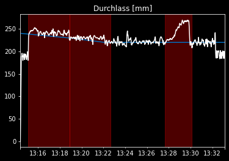

    

# Makeathlon2022

This repository contains the solution for the Makeathlon Challenge 2022 hosted at Fraunhofer IEM, Zukunftsmeile 2, 33102 Paderborn. The challenge was presented by a large industrial bakery seeking a data-driven solution for early failure diagnosis of their large kneading machine by means of anomaly detection. 

## Challenge Overview

The industrial bakery required a solution to detect early signs of failure in their large kneading machine. The machine was equipped with several laser sensors that measure the thickness of the dough. The challenge was to use this data to identify recurring defect classes and detect specific point anomalies such as jamming of dough in the machine or the dough not coming out of the machine as a whole flat dough piece.

## Solution

Our team developed an anomaly detection software that utilized the data collected from the laser sensors to identify abnormal behavior in the kneading machine. The software utilizes a large dataset of kneading machine operation logs and dough thickness measurements to identify normal patterns of operation. 

We then used this model to identify and classify recurring defect classes and detect specific point anomalies in the kneading machine. Our software used advanced statistical methods to identify subtle changes in the dough thickness measurements that could indicate potential problems with the machine.

## Persistent Anomalies

    
    
    
    
    
    
    
    
    
    
    
    
    
    

## Point Anomalies

    
    
    
    
    
    
    
    
    
    
    
    
    

## Conclusion

Our anomaly detection software proved to be a successful solution to the challenge presented by the industrial bakery. Our software was able to detect early signs of failure in the kneading machine by identifying abnormal behavior in the dough thickness measurements. We are proud to have finished second in the Makeathlon Challenge 2022, and although we did not win the grand prize, we consider it a great achievement and are grateful for the opportunity to participate.
